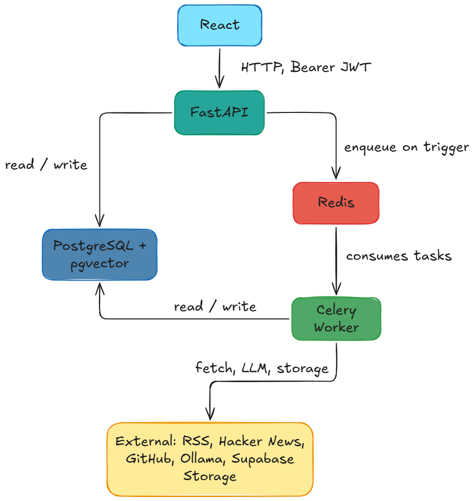

# InsightThreads Backend

**Turn scattered text sources into thematic clusters and actionable insights via a single API.**

A backend that ingests RSS, Hacker News, and GitHub activity, embeds and clusters content with pgvector, runs sentiment and time-series analysis, detects anomalies, and generates natural-language insights using local LLMs (Ollama).

[](LICENSE)

## Table of Contents

- [About](#about)
- [Architecture](#architecture)
- [Features](#features)
- [Tech Stack](#tech-stack)
- [Getting Started](#getting-started)
- [Usage](#usage)
- [Configuration](#configuration)
- [Project Structure](#project-structure)
- [Pipeline](#pipeline)
- [License](#license)

## About

**Problem:** Content from RSS, forums, and repositories is high-volume and unstructured. Finding themes, trends, and anomalies manually does not scale.

**Solution:** InsightThreads Backend runs an asynchronous pipeline: ingest → embed → cluster (HDBSCAN) → sentiment → time-series → anomaly detection → LLM insights. You receive clusters, keywords, daily summaries, and generated insights through a REST API.

**Why it matters:** One service to plug multiple text sources into a vector database and LLM stack with minimal glue code. Authentication is handled via Supabase JWT; storage and compute remain under your control (Postgres, Redis, Ollama).

## Architecture



## Features

- **Multi-source ingestion** – RSS, Hacker News, and GitHub (repositories, commits, issues, pull requests) in a single flow
- **Vector search** – Semantic search over documents via pgvector and sentence-transformers
- **Thematic clustering** – HDBSCAN with optional UMAP projections; cluster names generated by a local LLM
- **Sentiment analysis** – VADER and DistilBERT with combined scores per document and per cluster
- **Time-series and forecasting** – Daily mention counts and Prophet-based forecasts per cluster
- **Anomaly detection** – PyOD-based detection with configurable models feeding into trending signals
- **LLM insights** – Ollama (Llama3, Mistral, Phi3) generates concise insight text per cluster
- **Async pipeline** – Celery chord: parallel embedding and sentiment, followed by clustering → time-series → anomalies → insights
- **Authentication and storage** – Supabase JWT validation; optional Supabase Storage for ingestion snapshots

## Tech Stack

- **API:** FastAPI, Uvicorn, Pydantic
- **Database:** PostgreSQL, pgvector, SQLAlchemy 2 (async and sync), Alembic
- **Queue and cache:** Redis, Celery
- **Embeddings and ML:** sentence-transformers, UMAP, HDBSCAN, scikit-learn, KeyBERT
- **Sentiment:** VADER, Transformers (DistilBERT)
- **Forecasting:** Prophet, Pandas
- **Anomaly detection:** PyOD
- **LLM:** Ollama (Llama3, Mistral, Phi3)
- **Authentication:** Supabase (JWT)

## Getting Started

### Prerequisites

- **Python 3.11+**
- **PostgreSQL** with [pgvector](https://github.com/pgvector/pgvector) enabled
- **Redis**
- **Ollama**

### Installation

```bash
# Clone the repository
git clone https://github.com/hassnain-kazmi/insight-threads-backend.git
cd insight-threads-backend

# Create virtual environment
python -m venv .venv
source .venv/bin/activate   # Windows: .venv\Scripts\activate

# Install dependencies (CPU-only PyTorch for embeddings)
pip install torch --index-url https://download.pytorch.org/whl/cpu
pip install -r requirements.txt

# Run database migrations
alembic upgrade head
```

### Run locally

```bash
# Terminal 1: Redis (if not running as a service)
redis-server

# Terminal 2: Celery worker
celery -A app.celery_app worker -l info

# Terminal 3: API
uvicorn app.main:app --reload --host 0.0.0.0 --port 8000
```

API: `http://localhost:8000`  
Docs: `http://localhost:8000/docs`

### Docker

```bash
docker build -t insight-threads-backend .
docker run -p 8000:8000 --env-file .env insight-threads-backend
```

Run Postgres (with pgvector), Redis, and Celery separately or via your orchestration (e.g., Docker Compose).

## Usage

### Health check

```bash
curl http://localhost:8000/health
```

### Trigger ingestion (requires Bearer JWT)

```bash
curl -X POST http://localhost:8000/ingest/trigger \
  -H "Authorization: Bearer YOUR_SUPABASE_JWT" \
  -H "Content-Type: application/json" \
  -d '{"source": "rss", "source_params": {"feed_urls": ["https://example.com/feed.xml"]}}'
```

Response (202):

```json
{
  "ingest_event_id": "uuid",
  "task_id": "celery-task-id",
  "status": "pending"
}
```

### List clusters

```bash
curl http://localhost:8000/clusters \
  -H "Authorization: Bearer YOUR_SUPABASE_JWT"
```

### Semantic search

```bash
curl "http://localhost:8000/search?query=machine%20learning&limit=10" \
  -H "Authorization: Bearer YOUR_SUPABASE_JWT"
```

### API Endpoints

- **GET** `/` – Root API message
- **GET** `/health` – Health and database status
- **GET** `/auth` – Current user (JWT)
- **POST** `/ingest/trigger` – Trigger ingestion (RSS, Hacker News, GitHub)
- **GET** `/ingest/events` – List ingest events
- **GET** `/ingest/events/{event_id}` – Get one ingest event
- **GET** `/documents` – List documents
- **GET** `/documents/{document_id}` – Get one document
- **GET** `/clusters` – List clusters
- **GET** `/clusters/{cluster_id}` – Get one cluster
- **GET** `/insights` – List insights
- **GET** `/insights/{insight_id}` – Get one insight
- **GET** `/anomalies` – List anomalies
- **GET** `/search` – Semantic search (query, limit, similarity threshold)
- **GET** `/umap/clusters/{cluster_id}` – UMAP projection for a cluster
- **GET** `/umap/documents` – UMAP projection for user documents

## Configuration

Copy `.env.example` to `.env` and set values. Use `ENV_STATE=dev` or `prod`; prefix variables with `DEV_` or `PROD_` as defined in `app/config.py`.

Key variables include:

- **ENV_STATE** – `dev` or `prod` (default: `prod`)
- `POSTGRES_*` – Database credentials and connection details
- **REDIS_HOST**, **REDIS_PORT**, **REDIS_PASSWORD** – Redis broker and backend
- **SUPABASE_URL**, **SUPABASE_JWT_SECRET**, **SUPABASE_SERVICE_KEY**, **SUPABASE_STORAGE_BUCKET** – Authentication and optional storage
- **CORS_ORIGINS** – Comma-separated origins for CORS
- **GITHUB_TOKEN** – Optional token for GitHub API access
- **OLLAMA_BASE_URL**, **OLLAMA_MODEL**, **OLLAMA_TIMEOUT**, **OLLAMA_MAX_RETRIES**, **OLLAMA_CONTEXT_SIZE** – Ollama configuration
- **LOG_LEVEL**, **LOG_DIR**, **DEBUG** – Logging and debug settings

## Project Structure

```
insight-threads-backend/
├── .github/
│   └── workflows/        # CI
├── app/
│   ├── main.py           # FastAPI app entry
│   ├── config.py         # Settings, env vars
│   ├── db.py             # DB connection, session
│   ├── celery_app.py     # Celery app
│   ├── logging_config.py # Logging setup
│   ├── api/              # Route handlers
│   ├── models/           # SQLAlchemy models
│   ├── schemas/          # Pydantic schemas
│   ├── services/         # Business logic
│   ├── tasks/            # Celery tasks (ingest, embed, cluster, etc.)
│   ├── ml/               # Embeddings, clustering, sentiment, UMAP
│   └── utils/            # Helpers, logger
├── infra/
│   └── db/               # DB init
├── migrations/           # Alembic
├── docs/                 # Architecture diagram
├── requirements.txt
├── Dockerfile
└── README.md
```

## Pipeline

Asynchronous flow (Celery):

1. **Ingest:** Fetch from RSS, Hacker News, and GitHub; write documents and snapshot to Supabase Storage.
2. **Embed and Sentiment:** Parallel per-document tasks using sentence-transformers, VADER, and DistilBERT.
3. **Clustering:** HDBSCAN on embeddings; cluster names generated via Ollama; write clusters and cluster members.
4. **UMAP:** Optional 2D projections per user or session (enqueued after clustering).
5. **Time-series:** Daily summaries and Prophet forecasts per cluster.
6. **Anomalies:** PyOD on time-series data; update trending scores.
7. **Insights:** Ollama generates insight text per cluster; stored in insights.

## License

MIT © [Syed Hassnain Kazmi](LICENSE). See [LICENSE](LICENSE) for full text.
